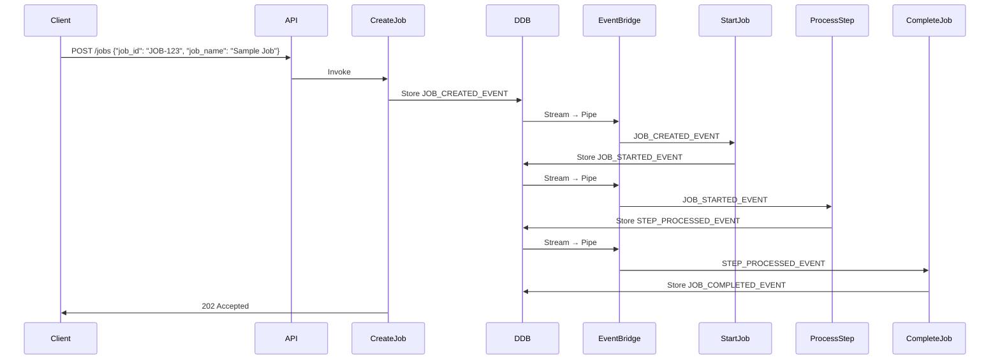

# Python DynamoDB Event-Driven Architecture

(This README has been AI generated, so it adds some hype to it, but from my latest review it's actually pretty accurate)

A serverless, event-driven job processing system built on AWS using Python, DynamoDB Streams, EventBridge, SQS queues and Lambda functions. This project demonstrates a modern event sourcing pattern with complete event traceability and asynchronous job processing.

## 📋 Table of Contents

- [What It Is](#what-it-is)
- [How It Works](#how-it-works)
- [Architecture](#architecture)
- [Key Components](#key-components)
- [Event Flow Example](#event-flow-example)
- [Project Structure](#project-structure)
- [Prerequisites](#prerequisites)
- [Getting Started](#getting-started)
- [Build & Deployment](#build--deployment)
- [Testing the System](#testing-the-system)
- [Teardown](#teardown)
- [Development](#development)
- [Technical Details](#technical-details)

## What It Is

This project is a **Proof of Concept (POC)** that demonstrates an **event-driven architecture** using AWS serverless technologies. It showcases:

- **Event Sourcing**: All state changes are captured as immutable events
- **Serverless Architecture**: Built entirely on AWS Lambda functions
- **Asynchronous Processing**: Events flow through multiple processing stages automatically
- **Idempotency**: Safe to retry operations without side effects
- **Observability**: Complete audit trail of all event lifecycle

**⚠️ Important**: This is a demonstration system that doesn't perform actual job processing work. Instead, it focuses on showing how events flow through the system, with each worker simply transitioning jobs to the next state by raising new events.

The system demonstrates event transitions through a pipeline: `CREATED` → `STARTED` → `PROCESSING` → `COMPLETED`.

## How It Works

1. **Job Creation**: HTTP POST to `/jobs` endpoint creates a new job
2. **Event Storage**: Job creation event is stored in DynamoDB
3. **Stream Processing**: DynamoDB Streams capture data changes
4. **Event Distribution**: EventBridge distributes events to appropriate workers
5. **Asynchronous Processing**: Lambda workers process jobs through different stages
6. **State Progression**: Each worker moves the job to the next state by raising new events

## Architecture

```
┌─────────────────┐    ┌──────────────┐    ┌─────────────────┐
│   HTTP Client   │───▶│  API Gateway │───▶│ Create Job λ    │
└─────────────────┘    └──────────────┘    └─────────┬───────┘
                                                     │
                                                     ▼
                                           ┌─────────────────┐
                                           │   DynamoDB      │
                                           │  Event Store    │
                                           └─────────┬───────┘
                                                     │
                                              ┌──────▼──────┐
                                              │ DDB Stream  │
                                              └──────┬──────┘
                                                     │
                                              ┌──────▼──────┐
                                              │EventBridge  │
                                              │    Pipe     │
                                              └──────┬──────┘
                                                     │
                               ┌─────────────────────┼─────────────────────┐
                               │                     │                     │
                        ┌──────▼──────┐    ┌────────▼────────┐   ┌────────▼────────┐
                        │ SQS Queue   │    │  SQS Queue      │   │  SQS Queue      │
                        └──────┬──────┘    └────────┬────────┘   └────────┬────────┘
                               │                     │                     │
                        ┌──────▼──────┐    ┌────────▼────────┐   ┌────────▼────────┐
                        │Start Job λ  │    │Process Step λ   │   │Complete Job λ   │
                        │(JOB_CREATED)│    │(JOB_STARTED)    │   │(STEP_PROCESSED) │
                        └─────────────┘    └─────────────────┘   └─────────────────┘
```

## Key Components

### 🏗️ Infrastructure (CDK)

- **MainStack**: Orchestrates all AWS resources
- **DynamoDbConstruct**: Event store table with streams enabled
- **EventDriverConstruct**: DynamoDB Stream → EventBridge integration
- **ApiConstruct**: HTTP API Gateway setup
- **ApiEndpointConstruct**: API Gateway endpoint + Lambda function
- **WorkerConstruct**: Lambda function + SQS queue + EventBridge rules

### 🔄 Event System

- **EventBase**: Base class for all events with DynamoDB/EventBridge parsing
- **Event Store Client**: Handles event persistence with idempotency
- **Typed Events**: `JobCreatedEvent`, `JobStartedEvent`, `StepProcessedEvent`, `JobCompletedEvent`

### ⚙️ Workers (Lambda Functions)

- **Start Job Worker**: Responds to `JOB_CREATED_EVENT` → creates `JOB_STARTED_EVENT`
- **Process Step Worker**: Responds to `JOB_STARTED_EVENT` → creates `STEP_PROCESSED_EVENT`
- **Complete Job Worker**: Responds to `STEP_PROCESSED_EVENT` → creates `JOB_COMPLETED_EVENT`

### 🌐 API Endpoints

- **POST /jobs**: Create a new job (triggers the processing pipeline)
- **GET /jobs/{jobId}/events**: List all events for a specific job (retrieve event history)

## Event Flow Example

Here's what happens when you create a job with ID "JOB-123":



## Project Structure

```
python-ddb-event-driven/
├── infra/                              # AWS CDK Infrastructure as Code
│   ├── app.py                          # CDK app entry point
│   ├── main_stack.py                   # Main CloudFormation stack
│   └── custom_constructs/              # Reusable CDK constructs
│       ├── api_construct.py            # HTTP API Gateway setup
│       ├── api_endpoint_construct.py   # API endpoint + Lambda
│       ├── dynamodb_construct.py       # DynamoDB table with streams
│       ├── event_driver_construct.py   # Stream → EventBridge pipe
│       └── worker_construct.py         # Worker Lambda + SQS + EventBridge
│
├── services/                           # Lambda function source code
│   ├── __events/                       # Event system components
│   │   ├── event_base.py               # Base event class & parsing logic
│   │   ├── event_store_client.py       # DynamoDB event persistence
│   │   ├── job_created_event.py        # Job creation event definition
│   │   ├── job_started_event.py        # Job started event definition
│   │   ├── step_processed_event.py     # Step processed event definition
│   │   └── job_completed_event.py      # Job completion event definition
│   │
│   ├── __errors/                       # Custom exception classes
│   ├── __http_helpers/                 # HTTP response utilities
│   │
│   ├── create_job_endpoint/            # POST /jobs implementation
│   ├── list_events_endpoint/           # GET /jobs/{jobId}/events implementation
│   ├── start_job_worker/               # Processes JOB_CREATED_EVENT
│   ├── process_step_worker/            # Processes JOB_STARTED_EVENT
│   └── complete_job_worker/            # Processes STEP_PROCESSED_EVENT
│
├── deploy-scripts/                     # Build and deployment automation
│   ├── build-all-lambdas.sh            # Package all Lambda functions
│   ├── build-all-requirements-txt.sh   # Generate requirements.txt files
│   └── build-dist.sh                   # Rapid deployment script
│
├── _restclient/                        # HTTP client examples
├── cdk.json                            # CDK configuration
├── Pipfile                             # Python dependencies & scripts
└── pyproject.toml                      # Code quality tools configuration
```

## Prerequisites

- **Python 3.12+** with pipenv
- **Node.js 18+** and npm (for AWS CDK)
- **AWS CLI** configured with appropriate credentials
- **AWS Account** with permissions to create:
  - DynamoDB tables
  - Lambda functions
  - API Gateway
  - EventBridge
  - SQS queues
  - IAM roles
  - CloudFormation stacks

## Getting Started

### 1. Clone and Setup Environment

```bash
git clone <repository-url>
cd python-ddb-event-driven

# Install Python dependencies
pipenv install --dev

# Activate virtual environment
pipenv shell
```

### 2. Configure AWS Credentials

```bash
# Configure AWS CLI (if not done already)
aws configure

# Verify access
aws sts get-caller-identity
```

### 3. Build & Deployment

```bash
# Package all Lambdas (builds and packages deployable Lambdas)
pipenv run build-dist

# Bootstrap CDK (one-time per account/region)
pipenv run bootstrap

# (Optional) Synthesize CloudFormation templates locally
pipenv run synth

# Deploy the stack
pipenv run deploy
```

### 4. Deployment Outputs

After successful deployment, you'll see outputs like:

```
Outputs:
pyDdbEd-dev.ApiEndpoint = https://example123.execute-api.us-east-1.amazonaws.com
pyDdbEd-dev.EventBusName = pyDdbEd-dev-event-driver-bus
pyDdbEd-dev.TableName = pyDdbEd-dev-ddb-event-store-table
```

## Testing the System

### 1. Create a Job (Trigger the Pipeline)

```bash
# Replace with your actual API endpoint from deployment outputs
export API_ENDPOINT="https://example123.execute-api.us-east-1.amazonaws.com"

# Create a new job
curl -X POST "${API_ENDPOINT}/jobs" \
  -H "Content-Type: application/json" \
  -d '{
    "job_id": "JOB-12345",
    "job_name": "My Test Job"
  }'

# Expected response: 202 Accepted
```

### 2. List Job Events

```bash
# List all events for the job to see the progression
curl -X GET "${API_ENDPOINT}/jobs/JOB-12345/events"

# You should see all events: CREATED → STARTED → PROCESSED → COMPLETED
```

### 3. Monitor Events in CloudWatch

```bash
# View logs for different components
aws logs tail /aws/lambda/pyDdbEd-dev-create-job-endpoint --follow
aws logs tail /aws/lambda/pyDdbEd-dev-start-job-worker --follow
aws logs tail /aws/lambda/pyDdbEd-dev-process-step-worker --follow
aws logs tail /aws/lambda/pyDdbEd-dev-complete-job-worker --follow
```

### 4. Using REST Client

If you're using VS Code with REST Client extension:

1. Create a `.env` file: `BASE_URL=https://your-api-endpoint.amazonaws.com`
2. Open `_restclient/create-job-endpoint.http` or `_restclient/list-events-endpoint.http`
3. Click "Send Request" to test the endpoints

### 5. Testing Idempotency

```bash
# Send the same job creation request multiple times
# It should return 202 Accepted each time without creating duplicates
curl -X POST "${API_ENDPOINT}/jobs" \
  -H "Content-Type: application/json" \
  -d '{
    "job_id": "JOB-12345",
    "job_name": "My Test Job"
  }'
```

## Teardown

### Complete Stack Removal

```bash
# Destroy all AWS resources
pipenv run destroy

# Confirm when prompted
```

**⚠️ Warning**: This will permanently delete:

- All DynamoDB data
- Lambda functions
- API Gateway
- EventBridge resources
- CloudWatch logs

### Partial Cleanup

```bash
# Only empty DynamoDB table (keep infrastructure)
aws dynamodb scan --table-name pyDdbEd-dev-ddb-event-store-table \
  --projection-expression "idempotencyKey" \
  --query "Items[].idempotencyKey.S" \
  --output text | xargs -I {} aws dynamodb delete-item \
  --table-name pyDdbEd-dev-ddb-event-store-table \
  --key '{"idempotencyKey":{"S":"{}"}}'
```

## Development

### Code Quality & Standards

```bash
# Format code
pipenv run format

# Lint and fix issues
pipenv run lint-fix

# Type checking
pipenv run type-check
```

### Adding New Event Types

1. **Define Event Classes**: Create new event in `services/__events/`

   ```python
   class MyCustomEvent(EventBase):
       eventName: str = "MY_CUSTOM_EVENT"
       eventData: MyCustomEventData
   ```

2. **Create Worker**: Add new worker in `services/my_custom_worker/`

3. **Update Infrastructure**: Add worker to `main_stack.py`

4. **Build & Deploy**: Run `pipenv run build-dist`

### Local Development

```bash
# Install new dependencies
pipenv install package-name

# Generate requirements.txt for Lambda layers
pipenv run build-requirements

# Quick rebuild after code changes
pipenv run build-lambdas
pipenv run deploy
```

### Build System Conventions

Our build system follows two key conventions that automatically detect and package Lambda functions:

#### 1. Deployable Lambda Detection

A folder inside `services/` is considered a **"deployable Lambda"** if it contains a Python file that matches the folder's name.

**Examples:**

- `services/create_job_endpoint/create_job_endpoint.py` ✅ (deployable)
- `services/start_job_worker/start_job_worker.py` ✅ (deployable)
- `services/list_job_events_endpoint/list_job_events_endpoint.py` ✅ (deployable)
- `services/__events/event_base.py` ❌ (shared module, not deployable)

**Detection Logic**: Located in `deploy-scripts/build-all-lambdas.sh` and `deploy-scripts/build-all-requirements-files.sh`

#### 2. Shared Module Convention

Any folder inside `services/` that starts with a **double underscore** (`__`) is considered a **"shared module"**.

**Shared modules:**

- `__events/` - Event classes and parsing logic
- `__errors/` - Custom exception hierarchy
- `__http_helpers/` - HTTP response utilities

#### 3. Build Process

When building a deployable Lambda, the build script (`_build_helpers.sh`) automatically:

1. **Detects** all deployable Lambdas using the naming convention
2. **Copies** all shared modules (`__*`) into each Lambda's build directory
3. **Installs** dependencies from each Lambda's individual `requirements.txt`
4. **Packages** everything into deployment-ready `.zip` files

**Trade-off**: Shared code gets duplicated across packages (not perfectly optimized), but this keeps the build process simple, reliable, and avoids complex dependency management at our current scale.

### Environment Variables

Set custom stack configuration:

```bash
export STACK_ID="my-project"
export STAGE_NAME="prod"
# Results in stack name: "my-project"
```

## Technical Details

### 🚀 Performance Characteristics

- **Cold Start**: ~200-500ms for Python Lambda functions
- **Throughput**: Limited by DynamoDB (40,000 RCU/WCU) and Lambda concurrency
- **Latency**: End-to-end job processing typically <5 seconds

### 💰 Cost Considerations

- **DynamoDB**: Pay per request/storage
- **Lambda**: Pay per invocation/execution time
- **EventBridge**: $1/million events
- **API Gateway**: $3.50/million API calls
- **Typical cost**: <$5/month for development workloads

### 🔧 Operational Features

- **CloudWatch Integration**: Automatic metrics and logging
- **X-Ray Tracing**: Enable by setting `TRACING_CONFIG` in Lambda constructs
- **Dead Letter Queues**: Failed events go to DLQ for investigation
- **Retry Logic**: Configurable retry attempts for worker functions

### 📈 Scaling Limits

- **DynamoDB**: Auto-scaling enabled, max 40K RCU/WCU per table
- **Lambda**: 1000 concurrent executions per region (can be increased)
- **EventBridge**: 10,000 rules per bus
- **SQS**: Virtually unlimited throughput

---

## 🤝 Contributing

1. Fork the repository
2. Create a feature branch: `git checkout -b feature/amazing-feature`
3. Make your changes following the code style
4. Test thoroughly: `pipenv run type-check && pipenv run lint`
5. Commit: `git commit -m 'Add amazing feature'`
6. Push: `git push origin feature/amazing-feature`
7. Open a Pull Request

## 📄 License

This project is licensed under the MIT License - see the [LICENSE](LICENSE) file for details.

---

**Built with ❤️ using AWS CDK, Python, and Serverless Technologies**
